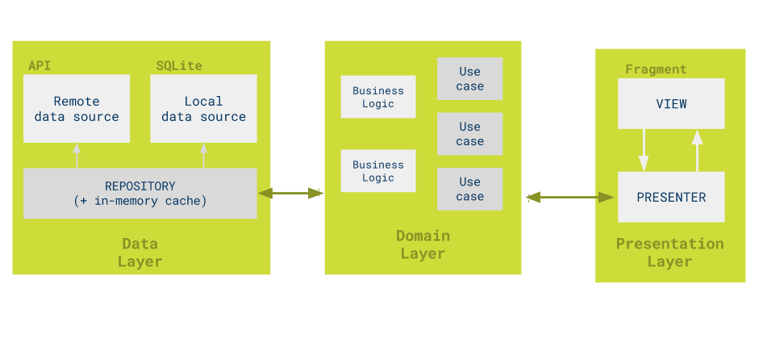

Android Clean Architecture
=========================

Project create by: Coderdaudat (coderdaudat@gmail.com)

I have written application stands on the principles of [Clean Architecture](https://blog.8thlight.com/uncle-bob/2012/08/13/the-clean-architecture.html).

[Architecting Android…The clean way?](http://fernandocejas.com/2014/09/03/architecting-android-the-clean-way/)

[Architecting Android…The evolution](http://fernandocejas.com/2015/07/18/architecting-android-the-evolution/)

Clean architecture
-----------------


Architectural approach
-----------------


Architectural reactive approach
-----------------


Summary
=========================
You must read before coding.

It's based on the MVP, adding a domain layer between the presentation layer and repositories, splitting the app in three layers:



* **MVP**: Model View Presenter pattern from the base sample.
* **Domain**: Holds all business logic. The domain layer starts with classes named *use cases* or *interactors* used by the application presenters. These *use cases* represent all the possible actions a developer can perform from the presentation layer.
* **Repository**: Repository pattern from the base sample.

### Key concepts
 Moving the domain layer from the presenters will help to avoid code repetition on presenters

*Use cases* define the operations that the app needs. This increases readability since the names of the classes make the purpose obvious .

*Use cases* are good for operation reuse over our domain code. .

The execution of these *use cases* is done in a background thread using the [command pattern](http://www.oodesign.com/command-pattern.html). The domain layer is completely decoupled from the Android SDK or other third party libraries.

### Issues/notes
*Use cases* run off the main thread, which is a good solution for Android apps.  This is done as soon as possible to avoid blocking the UI thread. I decided to use a command pattern and execute each use case with a thread pool.

I using asynchronous repositories, but there's no need to do this any more because use cases execute off the main thread.

I recommend using different models for View, domain and API layers, but in this case all models are immutable so there's no need to duplicate them. If View models contained any Android-related fields, we would use two models, one for domain and other for View and a mapper class that converts between them.

Callbacks have an `onError` method that in a real app should contain information about the problem.

### Testability

With this approach, all domain code is tested with unit tests. This can be extended with integration tests, that cover from Use Cases to the boundaries of the view and repository.

### Dependencies

Apart from support and testing libraries, none.

## Features

### Complexity - understandability

#### Use of architectural frameworks/libraries/tools:

None

#### Conceptual complexity

Medium-Low, it's an MVP approach with a new layer that handles domain logic.

### Code metrics


Adding a domain layer produces more classes and Java code.

### Maintainability

#### Ease of amending or adding a feature / Learning cost
Very easy. This approach is more verbose, making the maintenance tasks more obvious.


Code style
-----------

Here you can download and install the java codestyle.
https://github.com/ribot/android-guidelines/blob/master/project_and_code_guidelines.md

## Libraries

The libraries and tools used include:

- Support library
- RecyclerViews and CardViews
- [Retrofit](http://square.github.io/retrofit/) and [OkHttp](https://github.com/square/okhttp)
- [Glide](https://github.com/bumptech/glide)
- [Firebase](https://www.firebase.com/docs/android/)
- [Checkstyle](http://checkstyle.sourceforge.net/), [PMD](https://pmd.github.io/) and [Findbugs](http://findbugs.sourceforge.net/) for code analysis
- [Mockito](http://mockito.org/)
- [Espresso](https://google.github.io/android-testing-support-library/)

## Requirements

- [Android SDK](http://developer.android.com/sdk/index.html).
- Android [6.0 (API 23) ](http://developer.android.com/tools/revisions/platforms.html#6.0).
- Android SDK Tools
- Android SDK Build tools 23.0.1
- Android Support Repository

## Code Quality

This project integrates a combination of unit tests, functional test and code analysis tools.

### Tests

To run **unit** tests on your machine:

```
./gradlew test
```

To run **functional** tests on connected devices:

```
./gradlew connectedAndroidTest
```

Note: For Android Studio to use syntax highlighting for Automated tests and Unit tests you **must** switch the Build Variant to the desired mode.

### Code Analysis tools

The following code analysis tools are set up on this project:

* [PMD](https://pmd.github.io/): It finds common programming flaws like unused variables, empty catch blocks, unnecessary object creation, and so forth. See [this project's PMD ruleset](config/quality/pmd/pmd-ruleset.xml).

```
./gradlew pmd
```

* [Findbugs](http://findbugs.sourceforge.net/): This tool uses static analysis to find bugs in Java code. Unlike PMD, it uses compiled Java bytecode instead of source code.

```
./gradlew findbugs
```

* [Checkstyle](http://checkstyle.sourceforge.net/): It ensures that the code style follows [our Android code guidelines](https://github.com/ribot/android-guidelines/blob/master/project_and_code_guidelines.md#2-code-guidelines). See our [checkstyle config file](config/quality/checkstyle/checkstyle-config.xml).

```
./gradlew checkstyle
```

### The check task

To ensure that your code is valid and stable use check:

```
./gradlew check
```

This will run all the code analysis tools and unit tests in the following order:

